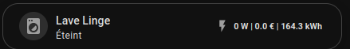
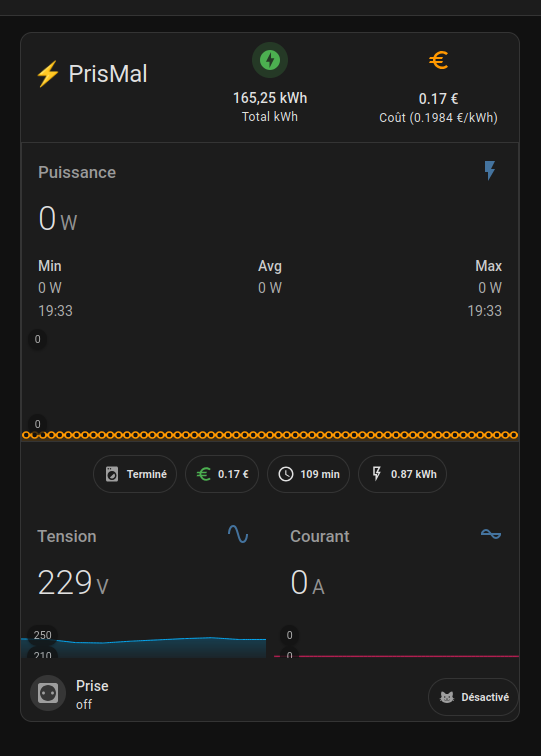
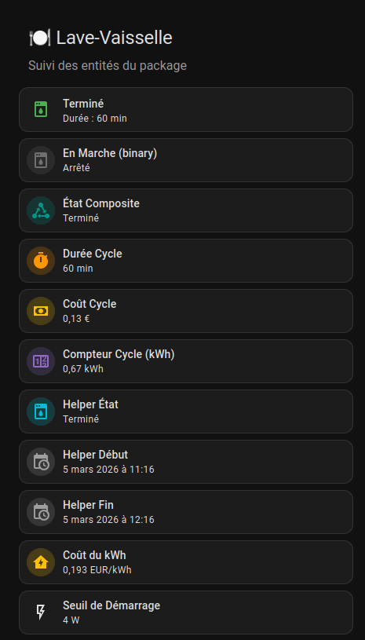

# ⚡ Gestion Énergie & Cycles (Lave-Linge / Lave-Vaisselle)

Ce package contient une solution complète et robuste pour surveiller, calculer le coût et notifier la fin des cycles de vos appareils électroménagers (Lave-Linge et Lave-Vaisselle) dans Home Assistant.

> 📖 **Tous les fichiers YAML** (Packages, Dashboards, Blueprint) sont **intégralement commentés** pour expliquer le rôle de chaque entité, variable et bloc de code. N'hésitez pas à les ouvrir pour comprendre le fonctionnement.

---

## ✨ Fonctionnalités Clés

*   **Détection d'état intelligente** : Ne se base pas simplement sur la puissance instantanée, mais utilise un algorithme (temps + seuil) pour déterminer si la machine est "En marche", "Terminée" ou "Éteinte".
*   **Double compteur d'énergie** : Un compteur **Total** (accumulation globale) et un compteur **Cycle** (remise à zéro automatique à chaque nouveau lavage) pour un suivi précis.
*   **Calcul du coût précis** : Isole la consommation électrique de **chaque cycle** et la multiplie par votre coût du kWh.
*   **Résilience 🛡️** : En cas de redémarrage de Home Assistant *pendant* un lavage, le système reprend exactement là où il en était (temps écoulé, état, coût). Rien n'est perdu.
*   **Notifications Persistantes** : Une fois le cycle terminé, une notification s'affiche dans HA avec le résumé (Coût, Durée, kWh). Elle reste tant que vous n'avez pas éteint la machine/prise.
*   **Aucun Polling** : 100% événementiel. Charge système nulle quand les machines ne tournent pas.

---

## 📂 Modules Disponibles

Chaque appareil possède son propre dossier avec sa documentation détaillée et ses fichiers de configuration.

### 🧺 [Gestion du Lave-Linge](./lave_linge/)
*   **Dossier** : [`lave_linge/`](./lave_linge/)
*   **Fonction** : Entités et Dashboards du cycle de lavage (Package & Templates).

### 🍽️ [Gestion du Lave-Vaisselle](./lave_vaisselle/)
*   **Dossier** : [`lave_vaisselle/`](./lave_vaisselle/)
*   **Fonction** : Entités et Dashboards du cycle de lavage (Package & Templates).

### 🤖 [Automatisations Personnelles](./perso/)
*   **Dossier** : [`perso/`](./perso/)
*   **Fonction** : Vos automatisations et dashboards liés à votre propre installation (Notifications Discord, IA K-2SO, Awtrix...).

---

## 🎨 Interface Utilisateur (Dashboards)

Vous trouverez dans les dossiers respectifs de chaque appareil **trois types de cartes Lovelace** prêtes à l'emploi. Vous pouvez copier leur code YAML directement dans votre dashboard Home Assistant.

### 1. Le Widget "Streamline" (Compact)
*   **Fichiers :** `carte_*_streamline.yaml` (Dans les dossiers `lave_linge/` & `lave_vaisselle/`)
*   **Usage :** Idéal pour une vue d'ensemble sur un écran d'accueil (mobile friendly).
*   **Bonus :** Animation CSS "Aura Verte" autour de l'icône lorsque l'appareil est en marche.

### 2. La Carte "Analyse Détaillée" (Standard)
*   **Fichiers :** `dashboard_final_*_perso.yaml` (Dans le dossier `perso/`)
*   **Usage :** Idéal pour une page dédiée à l'énergie.
*   **Contient :** Historique de la consommation sur les dernières 24h, monitoring de la tension électrique (V), état en direct et bouton d'action sur la prise.

### 3. Le Dashboard "Suivi Entités" (Admin)
*   **Fichiers :** `dashboard_entites_suivi.yaml` (Dans les dossiers `lave_linge/` & `lave_vaisselle/`)
*   **Usage :** Carte de débogage et de surveillance des variables cachées.
*   **Contient :** L'affichage en temps réel de tous les Helpers (`input_select`, `datetime`), du compteur brut et de l'état des déclencheurs de vos machines.

> ⚠️ **Pré-requis HACS** : Ces interfaces s'appuient sur des cartes personnalisées que vous devez installer via HACS : `mushroom-cards`, `mini-graph-card`, `stack-in-card`, et `card-mod`.

---

## 🚀 Installation & Utilisation (V4.2 - Blueprint)

L'architecture repose désormais sur un système hybride extrêmement puissant et simple à configurer : **Les Packages (pour les entités) + Un Blueprint (pour l'intelligence).**

### 1. Préparation des Entités (Le Package)
Déposez le fichier de configuration de l'appareil souhaité dans votre dossier `packages/` :
*   [`lave_vaisselle_package.yaml`](./lave_vaisselle/package/lave_vaisselle_package.yaml)
*   [`lave_linge_package.yaml`](./lave_linge/package/lave_linge_package.yaml)

> ⚠️ **ÉTAPE CRUCIALE AVANT REDÉMARRAGE** :
> Les fichiers ont été rendus génériques pour être partagés. Vous **DEVEZ** ouvrir le fichier `package` choisi et rechercher les occurrences taguées **`[A_CHANGER]`**.
> 
> 🍽️ **Lignes à modifier pour le Lave-Vaisselle (`lave_vaisselle_package.yaml`) :**
> *   **Lignes 64 & 73** : `source: sensor.A_CHANGER_ENERGIE` ➡️ Votre capteur de consommation d'énergie en kWh (ex: `sensor.prise_energie`)
> *   **Ligne 94** : `{{ states('sensor.A_CHANGER_PUISSANCE')|float(0) > ... }}` ➡️ Votre capteur de puissance en Watts (ex: `sensor.prise_puissance`)
>
> 🧺 **Lignes à modifier pour le Lave-Linge (`lave_linge_package.yaml`) :**
> *   **Lignes 71 & 80** : `source: sensor.A_CHANGER_ENERGIE` ➡️ Votre capteur de consommation d'énergie en kWh (ex: `sensor.prise_energie`)
> *   **Ligne 100** : `{{ states('sensor.A_CHANGER_PUISSANCE')|float(0) > ... }}` ➡️ Votre capteur de puissance en Watts (ex: `sensor.prise_puissance`)
>
> Sans remplacer ces variables clés, les capteurs ne remonteront aucune mesure et le blueprint de notifications ne s'activera pas !

> *Ce fichier `package` va générer automatiquement tous les capteurs virtuels, les compteurs de consommation et les variables (Helpers) nécessaires au bon fonctionnement.*

> 💡 **Note** : Les deux packages déclarent le même Helper `input_number.cout_du_kwh` (prix du kWh). C'est **un seul et unique** paramètre partagé par les deux appareils. Il suffit qu'**un seul** des deux packages soit installé pour que le système fonctionne. Si vous installez les deux, commentez l'un des deux dans le fichier package.

### 2. Importation du Blueprint (Le Cerveau)
Téléchargez ou copiez le fichier [`gestion_cycle_appareil.yaml`](./gestion_cycle_appareil.yaml) dans le dossier `blueprints/automation/` de votre Home Assistant.
> *Ce fichier Blueprint universel contient toute la logique complexe de suivi (reset des compteurs, timers, détection intelligente).*

### 3. Création de l'Automatisation via l'Interface (L'Action)
Depuis l'interface visuelle de Home Assistant, créez une nouvelle automatisation à partir du Blueprint `🔄 Gestion Énergie - Cycle Appareil`.
**C'est à vous de jouer ! 🎮**

Vous n'aurez qu'à configurer **2 entités** :
1. Le capteur de fonctionnement de l'appareil (ex: `binary_sensor.lave_vaisselle_en_marche`).
2. La prise connectée physique (ex: `switch.votre_prise`).

### 🔌 Options & Actions Libres
Le Blueprint déduira automatiquement le reste de vos entités. Vous avez le contrôle total sur la manière d'être notifié :
*   **Notification Persistante HA :** Vous pouvez activer/désactiver l'apparition de la notification locale de Home Assistant.
*   **Message de Fin Personnalisable :** Le texte de la notification est entièrement personnalisable depuis l'interface du Blueprint.
*   **Actions Libres (Démarrage & Fin) :** Deux blocs d'actions libres vous permettent de construire vos propres notifications (Discord, Telegram, scripts K-2SO, Alexa...).

> 💡 **Le petit plus magique :** Vous remarquerez que le texte par défaut contient des balises comme `{{ states(cout_cycle) }}`. Vous pouvez modifier la phrase comme bon vous semble, tant que vous gardez ces balises, le Blueprint s'occupera d'aller chercher et calculer automatiquement le bon capteur de coût, de durée ou d'énergie pour l'appareil concerné ! Vous pourrez ensuite réutiliser ce texte final dans vos Actions via la variable globale `{{ message_fin }}`.

---

## 📋 Pré-requis Généraux

*   Une **prise connectée** avec mesure de consommation (Puissance W & Energie kWh) pour chaque appareil.
*   Avoir configuré le `packages: !include_dir_named packages` dans votre `configuration.yaml`.
*   Avoir redémarré Home Assistant (ou rechargé les automatisations+blueprints) après l'ajout des fichiers.

